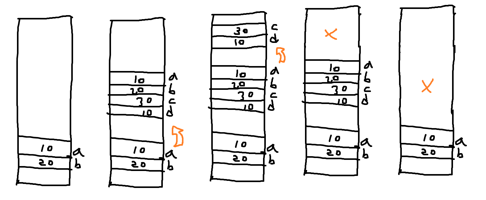

# 🥩스택🥩

---

## 🥓스택🥓

> + 선형구조
> + 후입선출 last in first out

> push : 넣기(삽입) , pop : 빼기(삭제)
> ### top : 마지막에 저장된 위치

> push 와 pop의 연산과정
> + push >>> top을 한칸 증가 후 a넣기
> + pop >>> a를뺀 뒤에 top 한칸 내리기

### #1 push 구현🥪

```python
def push(item,size):
    global top
    top += 1
    if top == size:
        print('overflow')
    else:
        stack[top] = item

size = 10
stack = [0]*size
top = -1

push(10,size)
top += 1
stack[top] = 20
```

### #2 pop 구현🌮

```python
size = 10
stack = [0]*size
top = -1


def my_pop():
    global top
    if top == -1:
        print('underflow')
        return 0
    else:
        top -= 1
        return stack[top+1]
print(my_pop())

if top > -1 : 
    top -= 1
    print(stack[top+1])
```

### #3 실습🌭

```python
##############################
size = 10 # 스택의 크기
stack = [0]*size # 스택만들기
top = -1 # 마지막으로 삽입된 원소의 인덱스

#########   PUSH하기   #########

    #1 첫번째 추가 push(1)
top += 1
stack[top] = 1
    #2 두번째 추가 push(2)
top += 1
stack[top] = 2
    #3 세번째 추가 push(3)
top += 1
stack[top] = 3

#########   POP하기   #########

    #1 pop(1)
top -= 1
print(stack[top+1])
    #2 pop(2)
top -= 1
print(stack[top+1])
    #3 pop(3)
top -= 1
print(stack[top+1])
```

### #4 스택응용🌯

> + 열림과호 나오면 push
> + 닫는괄호 나오면 pop
> + 다끝났는데, 괄호 남아있으면 error
> + 닫는괄호 나왔는데, pop할 괄호가 남아있지 않음 error

### #5 연습문제2🥙

> ((((())))()()()())))()(((())))
> + 괄호 제외 문자 무시
> + 여는 괄호 push
> + 닫는 괄호 pop
> + 에러조건
>   + 빈스택에 pop하면 error
>   + 짝 안맞으면 error
>   + 다 끝났는데 남아있는거 있으면 error

### #6 스택응용2🧆

> + main함수에서 f1호출 f1실행도중 f2호출하는 상황에서
> + f2에서 f1으로 돌아오기 위해서는 이동하기전에 돌아올주소를 기록해야댐
> + 그 기록이 스택에 저장됨
> + 스택에는 [ [main] [f1] [f2]<-top  ] 순서로 저장됨
```python
def f2(c,d):
    return c-d
def f1(a,b):
    c = a+b
    d = 10
    return f2(c,d)
a = 10
b=20
print(f1(a,b))
```


---

## 🥚재귀 호출🥚
> + 피보나치 함수
> + 팩토리얼 등..

```python
def f(n):
    global cnt
    cnt += 1
    if n== 1:
        return 1
    return n * f(n-1)
cnt = 0
f(100)
print(cnt)
```
### 2차원배열 재귀호출
```python
n = 3
def myprint(t):
    global n
    if t==n*n+1 :
        return

    print(t, end=" ")
    if t == n*(t//n):
        print()
    myprint(t+1)

myprint(1)
```
