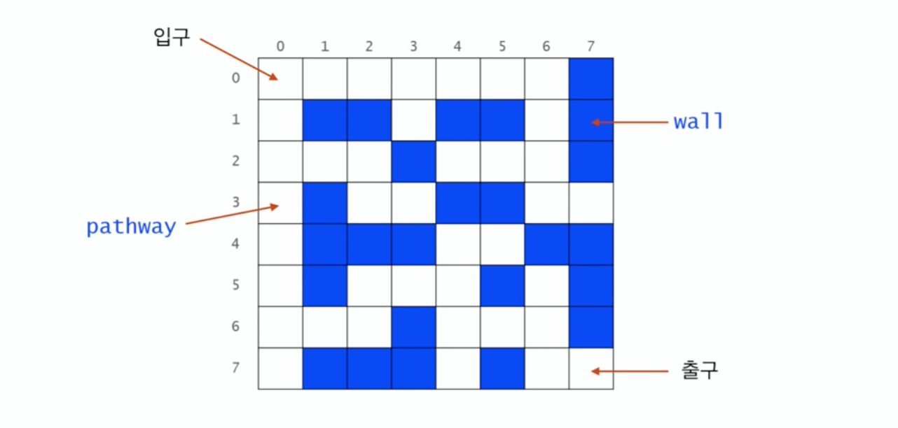
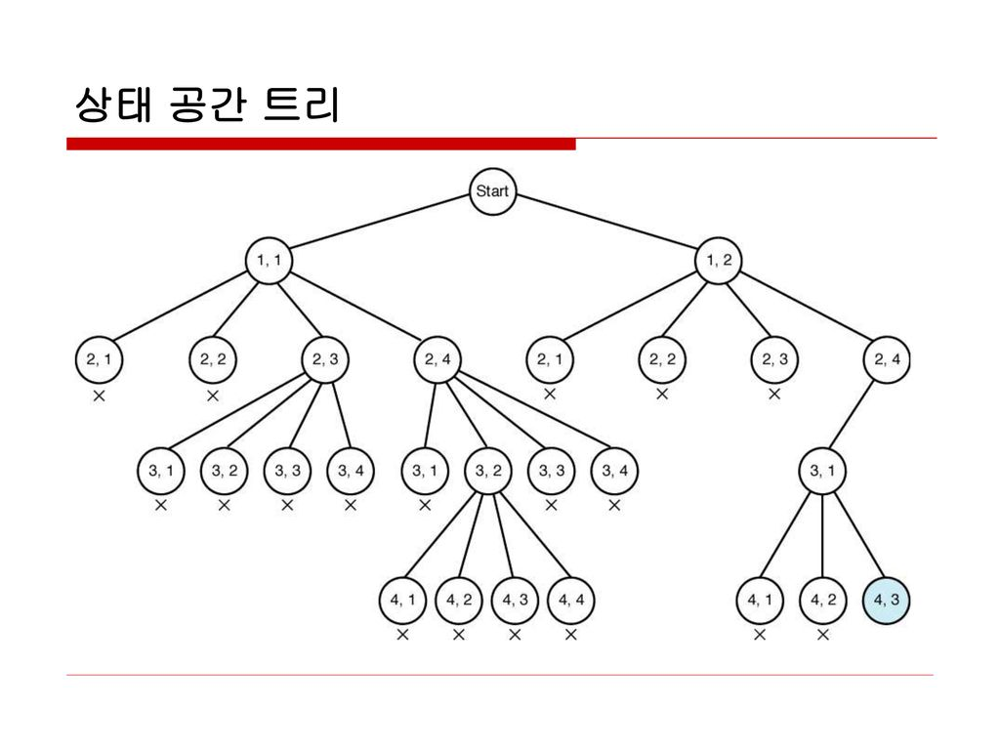

# 스택 2🍱

---
## 계산기 1🦀
> `(6+5*(2-8)/2)` 를 `6528-*2/+` 로 변환하기

### 🍋중위 표현식의 후위 표기식 변환🍋
> `a*b-a/b` 를 후위로 변환하면 `ab*ab/-`
>
> `(6+5*(2-8)/2)` 를 변환하면 `6528-*2/+`

#### 🍽`(6+5*(2-8)/2)` 변환과정 설명 🍽
+ `(` 여는 괄호 
    + 스택에 넣고 top 증가
+ `6` 숫자(피연산자) 는 바로 출력
+ `+` + 의 우선순위는 1 이라서 스택에 넣기 
+ `5` 출력 
+ `*` * 의 우선순위는 2 라서 스택에 넣기
+ `(` ( 의 우선순위는 3 이여야 하는데 0으로 스택에 넣기?>?>>??
+ `-` - 의 우선순위는 1 이라서 스택에 넣기
+ `)` 닫는 괄호
    + 여는 괄호 만날때까지 전부 pop하고 여는괄호와 닫는괄호는 버린다
+ `/` / 의 우선순위는 2이며, 현재 스택의 가장위에는 `*`(우선순위2)가 있음
    + `*`를 pop하여 출력 한 뒤 스택의 가장위에는 `-`(우선순위1)있음 > `/` 저장
+ `2` 저장
+ `)` 여는괄호 만날때까지 전부 pop
+ `6528-*2/+` 완성
#### 🥄연습문제🥄
🍷`2+3*4/5` >>> `( 2 + ( ( 3 * 4 ) / 5 ) )` >>> `234*5/+`  

🍷`2+3*4+5` >>> `234*+5+`

## 계산기 2🦐
> `6528-*2/+` 를 다시 `(6+5*(2-8)/2)`로 되돌리기

#### 🍴 `6528-*2/+` 변환과정 설명 🍴
+ `6` ( 스택의 가장아래 넣어짐 )
+ `5`
+ `2`
+ `8` 스택에 넣기 
+ `-` - 등장시 스택에서 `2,8` 을 pop해옴 `2 - 8` = `-6`을 다시 스택에 넣기
    + 현재 스택상황 : `-6 , 5 , 6 (아래) ]`
+ `*` * 등장시 `5,-6` pop해옴 `5 * (-6)` = `-30`을 다시 스택에 넣기
+ `2` 스택에 넣기
    + 현재 스택상황 : `2 , -30 , 6 (아래) ]`
+ `/` / 등장시 스택에서 `2, -30` pop `-30/2`= `-15`를 다시 스택에 넣기
+ `+` + 등장시 스택에서 `-15, 6` pop `6 + (-15)` = `-9` 끝냄

## 백트래킹🦑
> 최적화(min,max) 문제와 결정문제(Y/N)를 해결할 수 있다 

### 🍐백트래킹과 깊이우선탐색(DFS)과의 차이🍐
+ 이동하던 경로가 해결책으로 이어지지 않을것 같다면 다른데로 감 (Prunning 가지치기)
+ 일반적으로 경우의수가 줄어들지만, 최악의경우 여전히 지수함수시간(Exponential Time)을 요하므로 처리 불가능
+ 모든 후보를 검사하는게 아님!
### 🍑백트래킹 미로찾기🍑


[미로찾기 출처링크](https://velog.io/@protect-me/%EC%95%8C%EA%B3%A0%EB%A6%AC%EC%A6%98-02-%EC%9E%AC%EA%B7%80%ED%95%A8%EC%88%982-JS)
```python
maze = [
  [0, 0, 0, 0, 0, 0, 0, 1],
  [0, 1, 1, 0, 1, 1, 0, 1],
  [0, 0, 0, 1, 0, 0, 0, 1],
  [0, 1, 0, 0, 1, 1, 0, 0],
  [0, 1, 1, 1, 0, 0, 1, 1],
  [0, 1, 0, 0, 0, 1, 0, 1],
  [0, 0, 0, 1, 0, 0, 0, 1],
  [0, 1, 1, 1, 0, 1, 0, 0],
]
```
> + 길 따라 가면서 내가 지나온 길들을 스택에 저장
> + 막다른길일때, 스택확인하여 , 지나온길 중 다른선택지가 있었던 곳으로 이동후 다시 이동

### 🍓백트래킹 체스판🍓 (4*4 체스판에 퀸 4개 놓기  )
> `[0,0]` 後 `[1,0]`(불가능) 이상태에서 2열,3열에 더 놓아보는건 의미 없음  
> 그래서 백트래킹 해야됨
+ `[0,0]` 우선 놓기
  + `[1,0]` , `[1,1]` 불가능 `[1,2]` 놓기
    + 이상태에서 2열에 놓을수 있는 자리 없음
  + `[1,3]` 자리에 다시 놓기
  + 이런느낌 반복 했을때 결과적으로 4개 놓기가 불가능
+ 이번엔 `[1,1]` 에 놓고 시작하기  
  + 반복진행
  
> 깊이우선 : 155node  , 백트래킹 27node



[상태공간트리 출처링크](https://velog.io/@sana0803/%EB%B0%B1%ED%8A%B8%EB%9E%98%ED%82%B9)

## 실습🦞 ( SWEA 4875 미로)
```python
def dfs2(i,j,n):
    visited[i][j] = 1
    if maze[i][j] ==3: return 1
    else:
        for di,dj in [[0,1],[1,0],[0,-1],[-1,0]]:
            ni,nj = i+di , j+dj
            if 0<=ni<n and 0<=nj<n and maze[ni][nj] !=1 and visited[ni][nj]==0:
                if dfs2(ni,nj,n):
                    return 1
        return 0

def fstart(n):
    for i in range(n):
        for j in range(n):
            if maze[i][j] == 2:
                return  i,j
    return -1,-1


T =int(input())
for tc in range(1,T+1):
    n = int(input())
    maze = [list(map(int,input().split())) for _ in range(n)]

    sti ,stj = fstart(n)

    visited = [[0]*n for _ in range(n)]
    
    print(f'#{tc} {dfs2(sti, stj, n)}')
```


