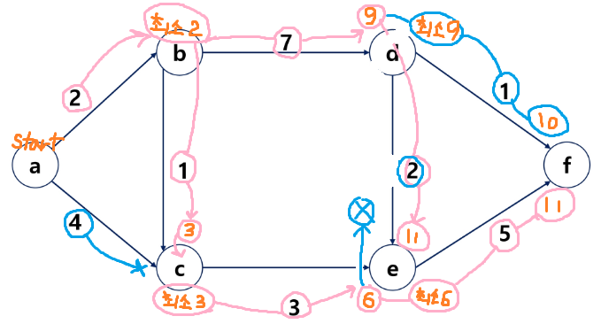

# ✨그래프 최소 비용✨

## 🏆목차
[1. 최소 비용 신장 트리 MST](#최소-비용-신장-트리-MST)  
[2. prim 알고리즘](#prim-알고리즘)  
[3. kruskal 알고리즘](#kruskal-알고리즘)  
[4. 최단경로 Dijkstra](#최단경로-Dijkstra)  

## 🏅최소 비용 신장 트리 MST
> 모든노드를 연결할거야  
> 간선들의 가중치 최솟값으로 연결할거야 
## 🥇prim 알고리즘
## 🥈kruskal 알고리즘
## 🥉최단경로 Dijkstra 

a  b   c   d   e   f
0 inf inf inf inf inf

우선순위 큐 append (2,b) (4,c)
(2,b)선택 pop
누적거리 기록 리스트 
a  b   c   d   e   f
0  2  inf inf inf inf

우선순위 큐 (4,c) (3,c) (9 , d)
정렬       (3,c) (4,c) (9 , d)
(3,c)선택 pop